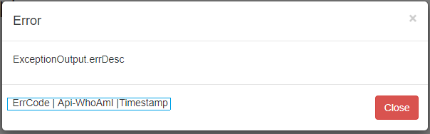

## Exception Handler For MFE_Refactoring Project's Rest Services

#### Abstract
* The exception handler structure of micro service projects need to be error-descriptive.
* Users shouldn't see application errors or application exceptions.
* Let's think of a scenario: A process needs to go through 4 micro-services, respectively. 
    When it encounters an error in the 3rd micro service or throws an exception, this error needs to be moved backwards properly, and its important to detect which micro-services has an error and when. 
* For this reason, Exception Output object includes timestamp, API, error-code, and whoAmI variables. Variables use front-end (presentation) layer. 
* A pop-up similar to the one below can be used.

  

### Guides
The following guides illustrate how to use some features:

* [Error Handling for REST with Spring](https://www.baeldung.com/exception-handling-for-rest-with-spring)
* [Spring REST Error Handling Example](https://www.mkyong.com/spring-boot/spring-rest-error-handling-example/)
* [Best way to define error codes/strings in Java](https://stackoverflow.com/questions/446663/best-way-to-define-error-codes-strings-in-java)
* [Define ReadOnly Repository](https://javabeat.net/spring-data-repository-read-only-write-only/)
* [Create a Custom Auto-Configuration with Spring Boot](https://www.baeldung.com/spring-boot-custom-auto-configuration)

